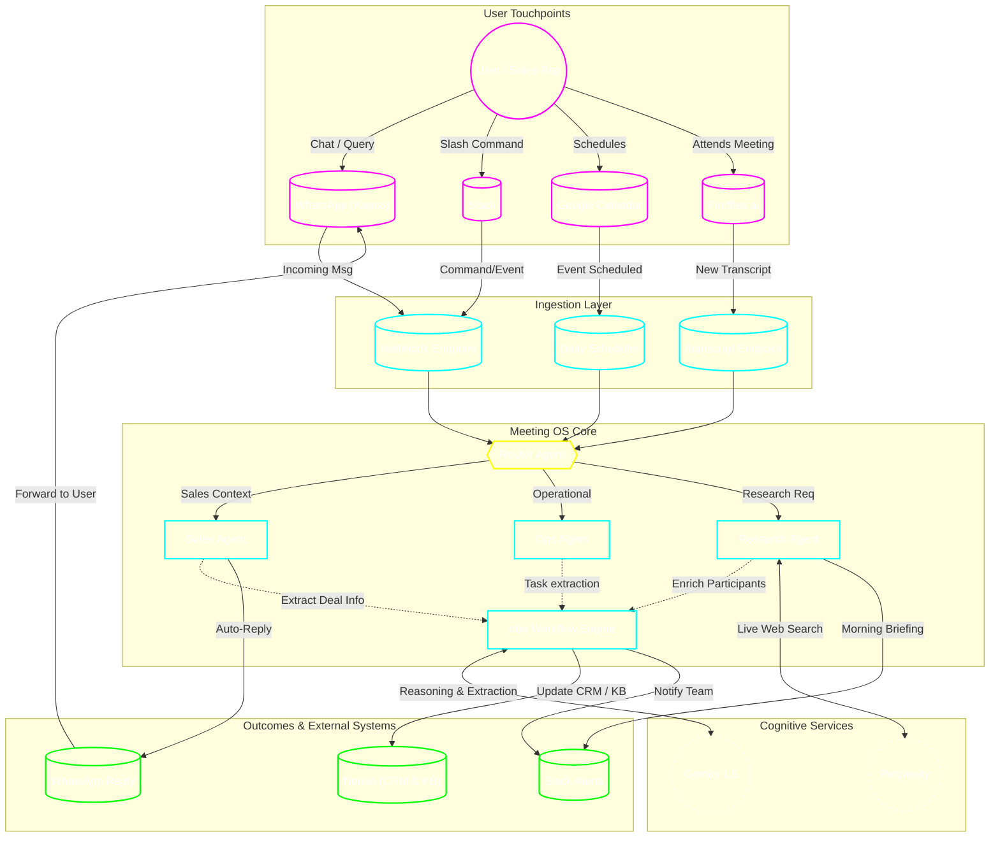
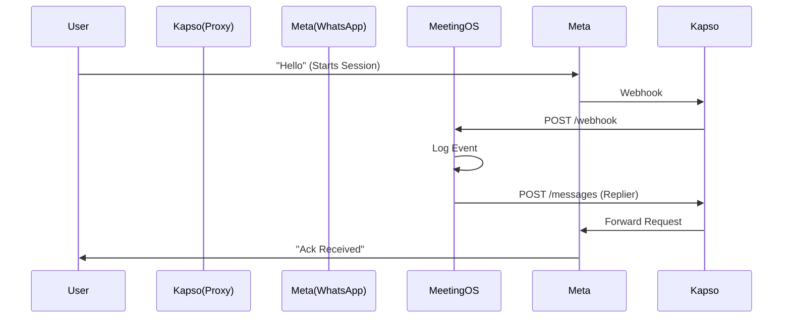
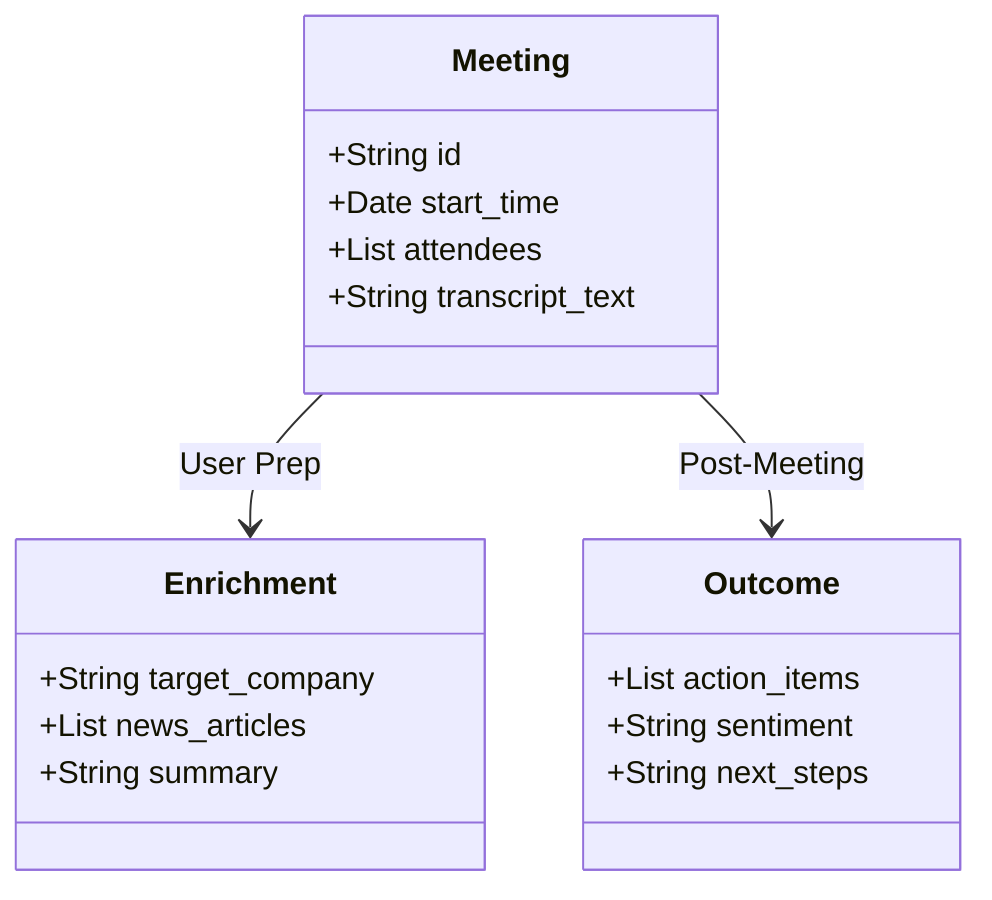
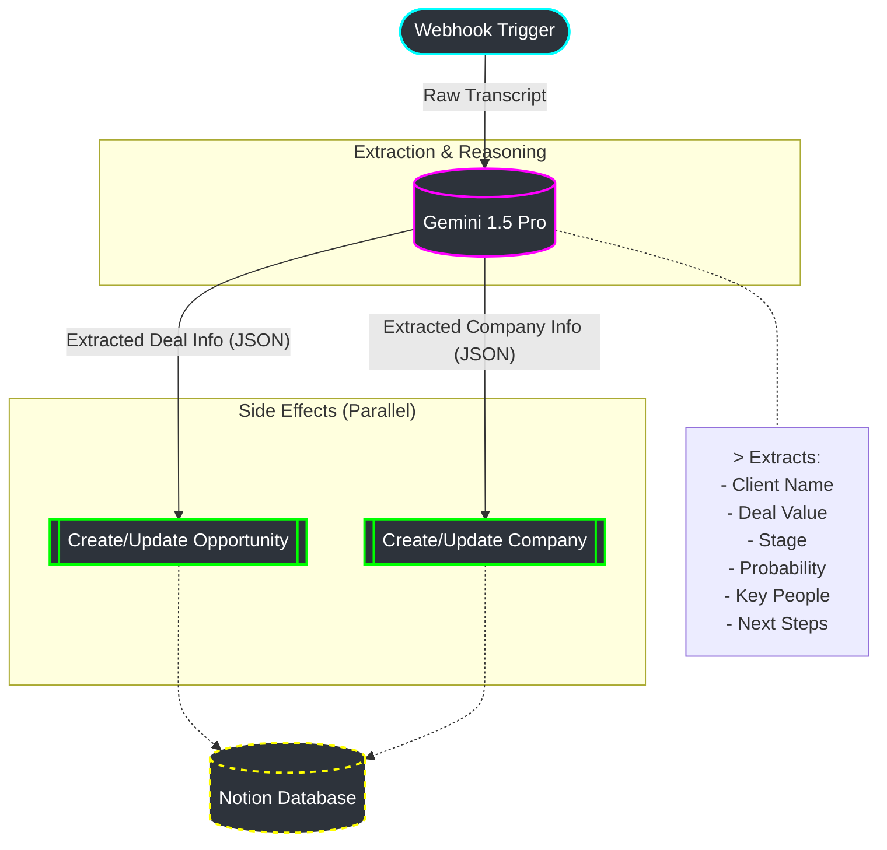

# Meeting Intelligence System Design

## 1. High-Level Architecture
This system ingests meeting contexts, processes them via AI agents, and outputs actionable insights to CRM and messaging platforms.

## 2. Component Flow: Kapso Integration
Detailing the WhatsApp communication flow.

## 3. Data Pipeline (E2E)
Structure of the data flowing through the system.

## 4. Workflow Engine (n8n Agent Logic)

The **Workflow Engine** (n8n) acts as the execution arm for complex, multi-step business logic. It orchestrates the flow of data between the Router, LLMs, and external systems (Notion, CRM).

**Example: Sales Agent Workflow**
This diagram illustrates the internal logic of the `Sales_Agent_Workflow` (defined in `meeting_os/sales_workflow.json`).

