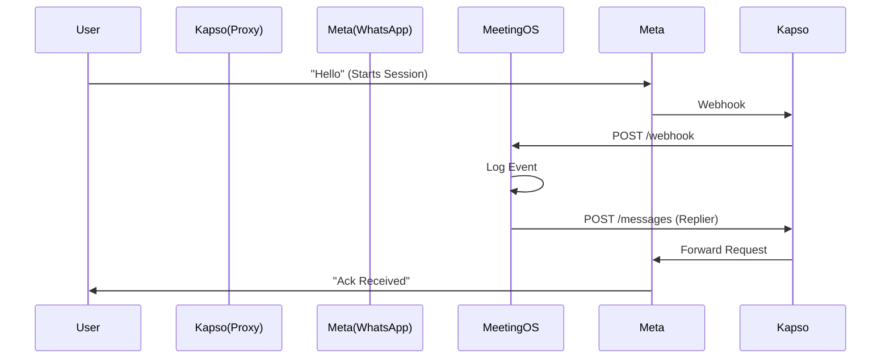
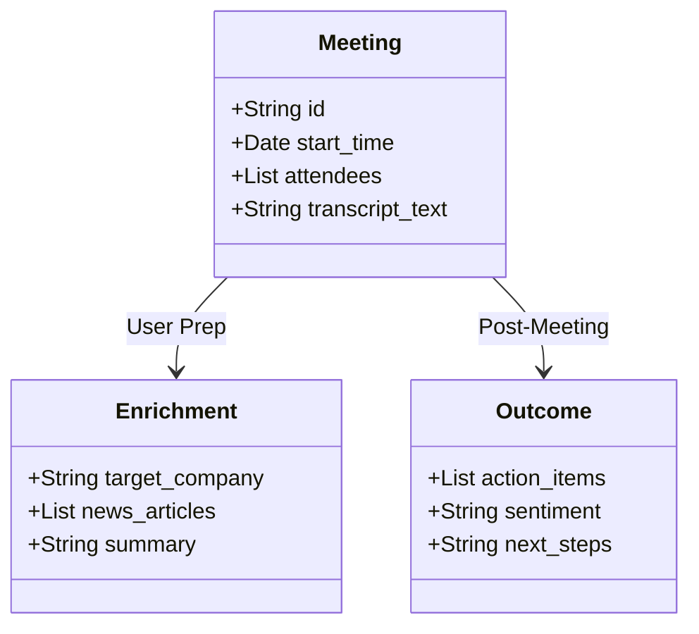

# Meeting Intelligence System Design

## 1. High-Level Architecture
This system ingests meeting contexts, processes them via AI agents, and outputs actionable insights to CRM and messaging platforms.

```mermaid
graph TD
    A[Google Calendar] -->|New Event| B(Daily Prep Trigger)
    B -->|Check Participants| C{Enrichment Needed?}
    C -->|Yes| D[Perplexity Agent]
    C -->|No| E[Wait for Meeting]
    D -->|Briefing| F[Notion / Slack]
    
    G[Fireflies.ai] -->|New Transcript| H(Transcript Processor)
    H -->|Text| I{Route by Topic}
    
    I -->|Sales| J[Sales Agent]
    I -->|Ops| K[Ops Agent]
    I -->|Misc| L[General Summary]
    
    J -->|Update CRM| M[HubSpot/Linear]
    J -->|Follow-up| N[WhatsApp (Kapso)]
    
    K -->|Action Items| O[Linear/Notion]
```

## 2. Component Flow: Kapso Integration
Detailing the WhatsApp communication flow.



## 3. Data Pipeline (E2E)
Structure of the data flowing through the system.


