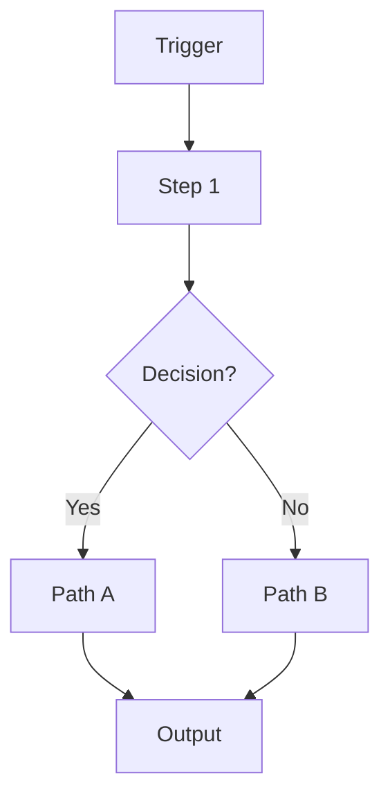

# Operations Playbook: "When you do it twice, write it down"

---

## The Golden Rule

**Regla:** "When you do it twice, write it down"

Esto aplica a TODO proceso que hagas más de 1 vez.

---

## Process Documentation Template

### Step 1: Capture Context
```markdown
# [Process Name]

## Context
- **Why:** [Por qué existe este proceso]
- **Trigger:** [Qué evento inicia el proceso]
- **Owner:** [Quién es responsible principal]
- **Backup:** [Quién puede ejecutar si owner absent]

## Inputs
- [Input 1]: [Source/Format]
- [Input 2]: [Source/Format]

## Outputs
- [Output 1]: [Destination/Format]
- [Output 2]: [Destination/Format]
```

### Step 2: Map the Flow


### Step 3: Define SOP
```markdown
## Step-by-Step

1. **[Step 1]** - [Action required] → [Who] → [Time]
2. **[Step 2]** - [Action required] → [Who] → [Time]
3. **[Step 3]** - [Action required] → [Who] → [Time]

## Edge Cases
- **Case 1:** [Edge case] → [Resolution]
- **Case 2:** [Edge case] → [Resolution]

## Escalation
- **Level 1:** [Who to contact] → [When]
- **Level 2:** [Who to contact] → [When]
- **Level 3:** [Founder] → [When]
```

---

## Common Processes (Start Here)

### Payroll Process
- **Inputs:** Employee hours, rates, deductions
- **Tools:** ADP, Gusto, Deel (local provider)
- **Outputs:** Payslips, tax filings, bank transfers
- **Owner:** HR Manager
- **Frequency:** Bi-weekly/Monthly

### Customer Onboarding
- **Inputs:** Contract signed, payment received, contact details
- **Tools:** Slack, Notion, CRM
- **Outputs:** User account created, welcome email sent, training scheduled
- **Owner:** Customer Success
- **SLA:** 24 hours from payment

### Vendor Management
- **Inputs:** Invoice, contract, performance
- **Tools:** Excel, email, Slack
- **Outputs:** Payment processed, renewal tracked
- **Owner:** Ops Manager
- **Review cycle:** Quarterly

---

## Process Freshness Audit

**Ejecutar mensualmente:**

```bash
# Check docs sin update >30 días
find docs/ -name "*.md" -mtime +30 -ls

# Alert a owner
for doc in outdated_docs; do
  echo "⚠️  $doc needs review" | slack @owner
done
```

---

## Decision Logging

### RAPID Framework
```yaml
decision_id: "DEC-001"
date: "2025-01-28"
topic: "Vendor selection - CRM system"

rapid:
  recommend: "COO - Pedro"
  agree: "CEO - Daniel"
  perform: "CTO - Juan"
  input: "Customer Success - Maria"
  decide: "CEO - Daniel"

outcome: "Select HubSpot (Phase 1), migrate to Linear (Phase 2)"
rationale: "Short-term wins (HubSpot) + Long-term fit (Linear)"
```

---

## SPOF Elimination

### Audit Process
1. **List all critical functions** (AORs)
2. **Check each for:**
   - [ ] Primary DRI identified?
   - [ ] Backup DRI trained?
   - [ ] Documentation exists?
3. **Flag gaps:** Alert al founder owner

### Example Critical Functions
| Function | Primary DRI | Backup | Trained? | Docs? |
|-----------|--------------|---------|-----------|--------|
| Payroll | Ana | Carlos | ✅ | ✅ |
| Sales | Pedro | None | ❌ | ✅ | ⚠️ SPOF |
| Product | Juan | Maria | ✅ | ❌ | ⚠️ Docs missing |

---

## Meeting Rhythms

### Daily Standups (15 min, max 5 people)
- **Format:**
  1. Yesterday (3 bullet max)
  2. Today (3 bullet max)
  3. Blockers (1 per person)

### Weekly Sync (45 min)
- **Pre-work:** Issues + decisions needed (24h before)
- **Format:** Written updates → Discussion → Decisions
- **Output:** Next actions with owners + deadlines

### Monthly Retrospective (60 min)
- **What worked?** (3 wins)
- **What failed?** (3 learnings)
- **What changes?** (3 action items)

---

## Quality Checks

### Before Going Live
- [ ] Process tested by 2 people?
- [ ] Edge cases covered?
- [ ] Owner + backup identified?
- [ ] Inputs/outputs defined?

### After Going Live
- [ ] Feedback collected after 2 weeks?
- [ ] Process adjusted?
- [ ] Documentation updated?

---

**Remember:** If you can't find a process in docs/playbooks/, it doesn't exist.
